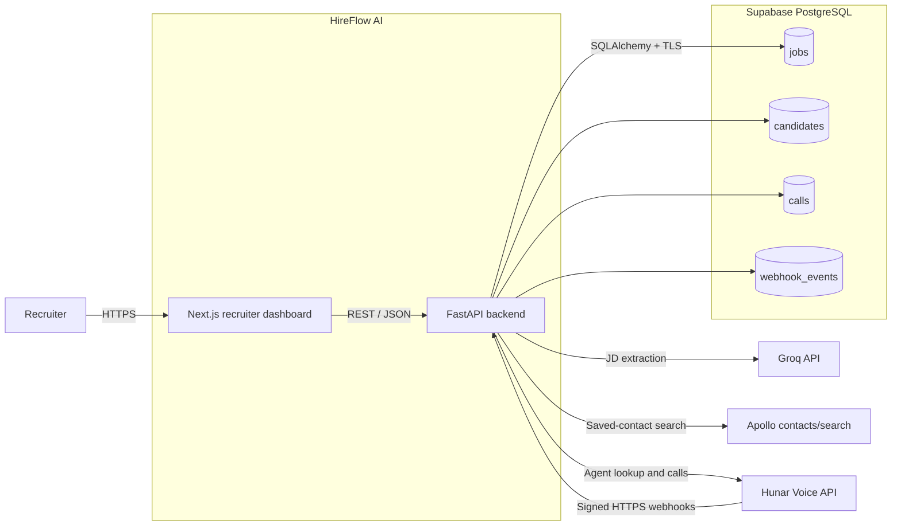
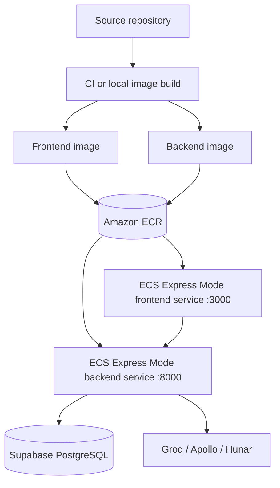
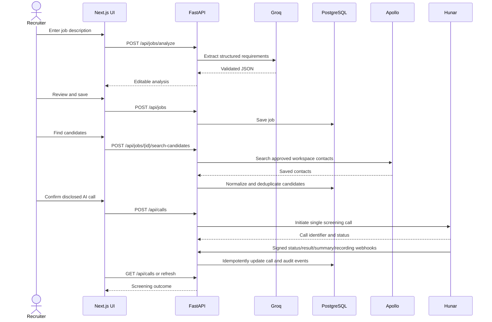

# HireFlow AI

HireFlow AI is an AI-assisted recruiting workflow built as an engineering assignment. It helps recruiters turn a job description into structured requirements, review recruiter-approved Apollo contacts, initiate consented AI screening calls through Hunar, and inspect call outcomes from a responsive dashboard.

The repository is a production-oriented monorepo with independently deployable frontend and backend containers.

| Deployment | URL |
| --- | --- |
| Frontend | `https://<deployed-frontend-url>` |
| Backend health | `https://<deployed-backend-url>/health` |
| Backend API documentation | `https://<deployed-backend-url>/docs` |

## Architecture



Production uses two separate images and services:



## Technology stack

| Layer | Technology |
| --- | --- |
| Frontend | Next.js App Router, React, TypeScript, Tailwind CSS, shadcn/ui-style components |
| Backend | Python 3.12, FastAPI, Pydantic, pydantic-settings |
| Data | PostgreSQL/Supabase, synchronous SQLAlchemy, Psycopg 3 |
| Integrations | Groq, Apollo, Hunar Voice, HTTPX |
| Local runtime | Docker Compose |
| Production | Multi-stage Docker images, Amazon ECR, Amazon ECS Express Mode |
| Testing | Pytest, FastAPI TestClient, mocked provider clients, ESLint, TypeScript, Next.js build |

## Features

- Live recruiter dashboard with job, candidate, call, completion, and interest totals.
- Job-description extraction with editable title, skills, location, experience, seniority, and search keywords.
- Persistent jobs, candidates, calls, and webhook events in PostgreSQL.
- Apollo saved-contact search with per-job deduplication and recruiter-review messaging.
- Manual candidate creation and E.164 phone editing.
- Hunar agent discovery, single AI screening call initiation, status refresh, summaries, results, duration, and recordings.
- Signed and idempotent Hunar webhook processing.
- Responsive loading, empty, validation, and provider-error states.
- Assignment 3 attendance-at-scale architecture proposal.
- Separate non-root frontend and backend production containers with health checks.

## End-to-end recruiting workflow



1. A recruiter enters a job title and full description.
2. Groq extracts only requirements supported by the description; the recruiter can edit them.
3. The reviewed job is saved to PostgreSQL.
4. HireFlow searches approved contacts already stored in the Apollo workspace and saves normalized candidates.
5. The recruiter reviews or completes candidate contact information.
6. After explicit confirmation that the call is AI-generated, HireFlow starts one Hunar screening call.
7. Hunar updates the call through signed webhooks; recruiters can also request a status refresh.
8. The dashboard displays status, interest, duration, availability, summary, and recording when provided.

## Local Docker setup

### Prerequisites

- Docker Desktop with Docker Compose
- A reachable PostgreSQL/Supabase database
- Provider credentials only for the provider workflows being tested

### Start the application

```bash
cp .env.example .env
```

Populate `.env` locally, then run:

```bash
docker compose up --build
```

Open:

- Frontend: `http://localhost:3000`
- Backend health: `http://localhost:8000/health`
- Interactive API documentation: `http://localhost:8000/docs`

Run in the background with:

```bash
docker compose up -d --build
docker compose ps
```

Stop local containers with:

```bash
docker compose down
```

Both services use `restart: unless-stopped`. The backend receives settings through Compose `env_file`; `NEXT_PUBLIC_API_URL` is passed to the frontend build because Next.js embeds public browser variables during compilation.

For Supabase, prefer the Session pooler connection string when Docker Desktop cannot route to the direct IPv6 database endpoint. Keep database TLS enabled and URL-encode password characters inside the connection string.

Hunar cannot send webhooks to localhost. For a consented local call test, start a temporary HTTPS tunnel to backend port 8000, put its public origin in `PUBLIC_BACKEND_URL`, and recreate the backend. Keep the tunnel running until all call webhooks arrive.

## Environment variables

Create `.env` from the following names and supply values only in your local environment, CI secret store, or AWS Secrets Manager. Never commit `.env`.

```dotenv
DATABASE_URL=
DATABASE_SSL=
DATABASE_INIT_ON_STARTUP=
SUPABASE_POOLER_HOST=

FRONTEND_URL=

GROQ_API_KEY=
GROQ_MODEL=
GROQ_TIMEOUT_SECONDS=

APOLLO_API_KEY=
APOLLO_CONTACTS_URL=
APOLLO_TIMEOUT_SECONDS=

HUNAR_API_KEY=
HUNAR_BASE_URL=
HUNAR_TIMEOUT_SECONDS=
PUBLIC_BACKEND_URL=

NEXT_PUBLIC_API_URL=
INTERNAL_API_URL=
```

`NEXT_PUBLIC_API_URL` is intentionally browser-visible and must contain only the public backend origin. All API keys and database credentials are backend-only secrets.

## Integrations

### Groq job-description extraction

The backend uses the configured Groq model with temperature `0`. The prompt requests JSON only and prohibits inventing information absent from the job description. Markdown fences are removed before parsing, the response is validated with Pydantic, and invalid JSON receives one correction attempt. Failure after both attempts returns a safe `502` response.

### Apollo saved-contact search

**Apollo `contacts/search` searches recruiter-approved contacts saved in the Apollo workspace because full People Search was unavailable on the account tier.**

HireFlow sends the job's generated search keywords as `q_keywords`, with one page of up to ten contacts. If that search is empty, it retries once without keywords and labels the returned contacts as recruiter-review suggestions—not guaranteed matches. Contacts are normalized, deduplicated by Apollo ID and job ID, and retained with their raw provider profile for traceability.

### Hunar calls and webhooks

HireFlow retrieves available Hunar agents and their required custom variables before initiating a call. Candidate phone numbers must use E.164 format. Each request receives a UUID, is stored locally, and contains the selected agent, candidate details, required job context, Asia/Kolkata timezone, and four public HTTPS callbacks.

The integration supports status, recording, result, and summary callbacks. A manual refresh retrieves the current Hunar call and updates provider status, duration, recording URL, result, summary, and retained raw response. Bulk calling is intentionally excluded.

### Webhook signature validation

Each webhook is verified before JSON parsing using:

- Headers: `X-Hunar-Signature` and `X-Hunar-Timestamp`
- Signing input: `{timestamp}.{raw_request_body}`
- Algorithm: HMAC SHA-256
- Encoding: Base64 digest
- Secret: backend-only `HUNAR_API_KEY`
- Replay window: five minutes

Comparison is constant-time. Valid payloads are stored in `webhook_events`, calls are located by request ID or Hunar call ID, and repeated events are acknowledged idempotently without duplicate processing.

## API endpoints

| Method | Endpoint | Purpose |
| --- | --- | --- |
| `GET` | `/health` | Check API and database connectivity |
| `POST` | `/api/jobs/analyze` | Extract structured requirements from a job description |
| `POST` | `/api/jobs` | Save a reviewed job analysis |
| `GET` | `/api/jobs` | List jobs with offset/limit pagination |
| `GET` | `/api/jobs/{job_id}` | Retrieve one job |
| `POST` | `/api/jobs/{job_id}/search-candidates` | Search and save Apollo workspace contacts |
| `GET` | `/api/candidates?job_id={job_id}` | List candidates for a job |
| `POST` | `/api/candidates/manual` | Create a manual candidate |
| `PATCH` | `/api/candidates/{candidate_id}/phone` | Update a candidate phone number |
| `GET` | `/api/hunar/agents` | List available Hunar agents |
| `GET` | `/api/hunar/agents/{agent_id}` | Retrieve Hunar agent configuration |
| `POST` | `/api/calls` | Initiate one AI screening call |
| `GET` | `/api/calls` | List calls, optionally filtered by job or candidate |
| `GET` | `/api/calls/{call_id}` | Retrieve one local call record |
| `POST` | `/api/calls/{call_id}/refresh` | Refresh a call from Hunar |
| `POST` | `/webhooks/hunar/status` | Receive a signed status event |
| `POST` | `/webhooks/hunar/recording` | Receive a signed recording event |
| `POST` | `/webhooks/hunar/result` | Receive a signed result event |
| `POST` | `/webhooks/hunar/summary` | Receive a signed summary event |

## Assignment 3: attendance at scale

The `/attendance` route is a design proposal titled **Attendance at Scale Without Smartphones**; it does not add an attendance backend.

The proposal uses RFID plus PIN or biometric kiosks at 100 offices, a local edge queue for offline operation, and a central attendance backend as the source of truth. A registered office landline and Hunar voice agent provide fallback, while exceptional attendance requires manager approval. An immutable audit trail records all actions.

LLMs are limited to summaries, anomaly explanations, HR questions, and daily reports. Deterministic code performs final attendance calculations. The design also addresses fraud prevention, offline synchronization, scaling for 1,000 employees, privacy, and employee consent.

## AWS ECR and ECS Express Mode deployment

1. Build the frontend and backend Dockerfiles as separate release images.
2. Supply the deployed backend origin as the frontend `NEXT_PUBLIC_API_URL` build argument.
3. Create separate Amazon ECR repositories and push each tagged image.
4. Create one ECS Express Mode service per image, exposing frontend port `3000` and backend port `8000`.
5. Configure the backend health check at `/health`; configure the frontend root route as its service health target.
6. Store provider keys and database credentials in AWS Secrets Manager or equivalent task secrets. Pass non-secret runtime settings through the service environment.
7. Set `FRONTEND_URL` to the deployed frontend origin and `PUBLIC_BACKEND_URL` to the public HTTPS backend origin.
8. Ensure outbound access from the backend service to Supabase, Groq, Apollo, and Hunar.
9. Validate Hunar webhook delivery after deployment and use independent service scaling policies.

The images run as non-root users and do not copy local `.env` files. The frontend uses Next.js standalone output. Introduce versioned database migrations and run them as a controlled deployment task before scaling beyond this assignment.

## Responsible AI, privacy, and consent

- Inform candidates clearly that the screening call is conducted by an AI agent and obtain consent before initiating it.
- Call only numbers supplied for recruitment use and honor withdrawal or do-not-call requests.
- Treat Groq extraction and Apollo results as recruiter decision support, not hiring decisions.
- Require human review of job requirements, candidate relevance, call summaries, and recommendations.
- Do not infer protected traits or use them for ranking, filtering, attendance, or employment decisions.
- Minimize access to personal information and recordings; define retention and deletion policies before production use.
- Restrict provider credentials to backend secret stores and avoid logging keys, signatures, headers, or complete phone numbers.
- Audit screening outcomes for bias, accessibility, language quality, and false summaries.

## Known limitations

- Authentication, authorization, roles, tenants, and recruiter identity are not implemented.
- Apollo search is limited to approved contacts already saved in the workspace and returns at most ten per request.
- Provider workflows depend on account permissions, quotas, availability, and correct agent configuration.
- Only individual Hunar calls are supported; there is no bulk calling, scheduling, retry queue, or cancellation workflow.
- Local Hunar testing requires a temporary public HTTPS tunnel.
- Schema creation uses SQLAlchemy initialization rather than versioned migrations.
- Automated tests mock external providers; they do not replace consented sandbox or staging verification.
- The attendance route is an architecture proposal only.

## Future improvements

- Add authentication, organization isolation, RBAC, and an administrative audit view.
- Introduce Alembic migrations, background jobs, provider retry policies, and dead-letter handling.
- Add encrypted field storage, configurable retention, deletion workflows, and recording access controls.
- Add candidate consent evidence, call scheduling, opt-out handling, and accessibility preferences.
- Add full browser end-to-end tests, contract tests, observability, tracing, and alerting.
- Add recruiter-defined scorecards with explainable, human-approved decision rules.
- Add CI/CD promotion across development, staging, and production ECS services.

## Screenshots

Add sanitized screenshots before final submission. Screenshots must not contain phone numbers, API keys, credentials, private URLs, or candidate personal data.

| View | Suggested file |
| --- | --- |
| Recruiting dashboard | `docs/screenshots/dashboard.png` |
| Job analysis and editing | `docs/screenshots/job-analysis.png` |
| Candidate review | `docs/screenshots/candidates.png` |
| AI call results | `docs/screenshots/calls.png` |
| Attendance architecture proposal | `docs/screenshots/attendance.png` |

## Testing

Backend tests use mocks and do not call Groq, Apollo, or Hunar.

```bash
cd backend
python3.12 -m venv .venv
source .venv/bin/activate
pip install -r requirements-dev.txt
pytest
python -m compileall -q app tests
```

Frontend validation:

```bash
cd frontend
npm ci
npm run lint
npm run type-check
NEXT_PUBLIC_API_URL=http://localhost:8000 npm run build
```

Docker validation:

```bash
docker compose config --quiet
docker compose build
docker compose up -d
docker compose ps
```

Expected health response:

```json
{"status":"healthy"}
```

At the time of the latest repository validation, all 58 backend tests passed, frontend lint and TypeScript checks passed, the Next.js production build passed, and both Docker images built successfully.

## Repository structure

```text
hireflow-ai/
├── backend/             # FastAPI application, database models, integrations, and tests
├── frontend/            # Next.js App Router recruiter dashboard
├── docker-compose.yml   # Local frontend/backend orchestration
├── .env.example         # Environment-variable template
└── README.md
```

No API keys, phone numbers, database credentials, or private deployment URLs belong in source control.
